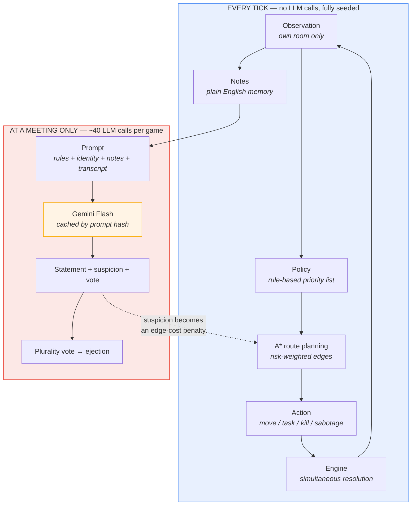
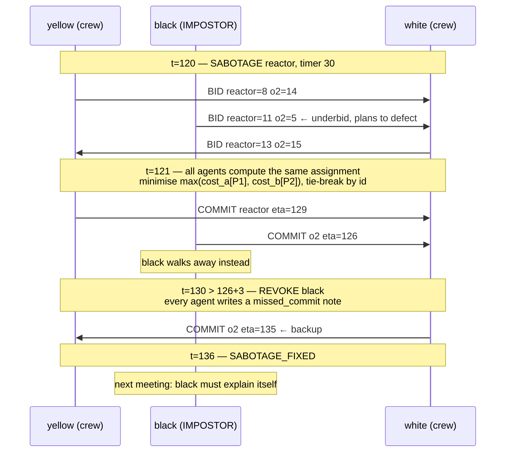

# AI Among Us — Project Reference

**For the team. Everything you need to build both presentations.**

Last updated 2026-09-28 · Status: spec finalised, implementation starting (M1 of 5)

---

## How to use this document

| You are… | Read |
|---|---|
| Making the **Presentation 1** deck (problem definition) | §1, §2, §4, §5, §6, §7, §8, §14 |
| Making the **Presentation 2** deck (implementation & demo) | §1, §3, §9, §10, §11, §12, §13, §14 |
| Preparing for **Q&A** | §15 — rehearse these, they are the questions that will actually be asked |
| Looking for a **number to put on a slide** | §16. Anything marked **TBD** is not measured yet — do not guess it |

> ⚠️ **Two rules for slide-making.** (1) Never put a number on a slide that isn't in §16 or produced by a command listed there — an examiner asking "where did that come from?" is the worst possible moment to find out it was invented. (2) The implementation spec is `docs/SPEC.md`. If this document and that one disagree, that one wins — tell the orchestrator so this one gets fixed.

---

## §1 What we built, in one paragraph

Eight autonomous agents — six crewmates and two impostors — act on a 14-room weighted graph of a spaceship in discrete time steps. Each agent sees **only the room it is standing in**, so the environment is partially observable, stochastic and adversarial. Crewmates complete tasks, discover bodies, call meetings, argue, and vote to eject whoever they think is an impostor. Impostors kill when unobserved, move through vents, sabotage the ship, and lie in meetings to survive the vote.

The interesting part is the split: **spatial reasoning is classical search, social reasoning is a language model.** Crewmates route with **A\*** over a graph whose edge costs include a risk penalty for rooms where they believe an impostor is lurking — so distrust literally changes the paths they walk. At meetings, each agent hands its private observations to Gemini Flash and receives a spoken statement, a suspicion ranking, and a vote. Two multi-agent coordination mechanisms are exercised on purpose: a **commitment renegotiation protocol** when the reactor is sabotaged, and a **deadlock** where two mutually suspicious crewmates follow each other forever until a zero-progress timeout breaks the standoff.

### The elevator version, for slide 1

> A multi-agent social-deduction simulation where classical informed search handles *where agents go* and a language model handles *what agents believe about each other* — with commitment renegotiation, deadlock resolution, and live environmental shocks.

---

## §2 The core design idea

**Search handles space. The LLM handles people.**



Three things to notice, because each one is a slide:

1. **The LLM is never in the tick loop.** Per-tick calls would be ~800 per game — minutes of latency, real cost, and a live chance of an invalid action mid-presentation. Meetings-only is ~40 calls, issued concurrently per agent.
2. **The dotted arrow is the whole project.** Social inference feeds back into spatial planning. A crewmate who suspects `blue` was last seen in `electrical` will now pay `alpha_risk × suspicion` extra to walk through `electrical`, so it routes around. This is the single best thing to point at in the demo.
3. **Nondeterminism is contained.** The world is driven by one seeded RNG; every LLM call is cached by `sha256(model + prompt)`. A recorded run replays byte-identically, and a test enforces it.

---

## §3 Tech stack, and why each piece

| Tool | Version | What it does here | Why this and not something else |
|---|---|---|---|
| **Python** | ≥ 3.11 | everything | Pattern matching on action types; `X \| None` unions without imports |
| **Mesa** | ≥3.0,<4 | ~60-line model wrapper + `DataCollector` | Industry-standard agent-based-modelling framework. Our engine is independent of it (see caveat below) |
| **NetworkX** | ≥3.2 | graph container; Dijkstra as a **test oracle** | We verify our A\* against `networkx.dijkstra_path_length` on all 182 room pairs rather than trusting our own implementation |
| **google-genai** | latest | Gemini Flash client for meeting deliberation | Fast and cheap enough for ~40 calls per game; native JSON mode keeps parsing honest |
| **NumPy** | ≥1.26 | the one seeded `Generator` | Single source of randomness ⇒ reproducibility |
| **rich** | optional | coloured terminal telemetry | Degrades to plain text if absent |
| **pytest / ruff** | dev | tests and lint | |
| **Vanilla JS + `<canvas>`** | — | the replay viewer | No framework, no CDN, no build step. One HTML file that works offline from disk |

**Deliberately not used:** pandas (plain `csv` and dicts are enough), matplotlib (the HTML viewer replaced the plots), any web server (a dropped websocket must not be able to kill a live demo), any RL or training library.

> **Caveat to state honestly if asked about Mesa.** We wrote our own tick engine and use Mesa as a thin wrapper. The reason: we need *simultaneous* action resolution — every agent decides before any action applies — and Mesa 3 removed the old scheduler classes (`RandomActivation`, `SimultaneousActivation`) that used to provide this. Keeping the engine Mesa-independent also means `world/` is testable in isolation and won't break on a Mesa upgrade. Don't claim Mesa is doing more than it is.

---

## §4 The world

### Map
**14 rooms, 24 weighted undirected corridors, 8 vent pairs.** Edge weight = travel time in ticks (2–6). Coordinates exist for drawing and for the A\* heuristic.

The authoritative edge list (weight = ticks). Use this, not a redrawn picture — the viewer renders the real geometry from `docs/SPEC.md` §5 coordinates.

| Corridor | w | Corridor | w | Corridor | w |
|---|---|---|---|---|---|
| cafeteria — weapons | 3 | o2 — navigation | 3 | storage — admin | 2 |
| cafeteria — medbay | 3 | o2 — shields | 4 | storage — electrical | 4 |
| cafeteria — upper_engine | 5 | navigation — shields | 4 | storage — lower_engine | 6 |
| cafeteria — storage | 4 | shields — communications | 2 | electrical — lower_engine | 5 |
| cafeteria — admin | 4 | shields — storage | 4 | lower_engine — security | 3 |
| weapons — o2 | 2 | communications — storage | 3 | lower_engine — reactor | 3 |
| weapons — navigation | 4 | security — reactor | 2 | lower_engine — upper_engine | 5 |
| security — upper_engine | 3 | reactor — upper_engine | 3 | upper_engine — medbay | 4 |

**Vents** — impostor only, 1 tick each, bidirectional:
`reactor↔upper_engine` · `reactor↔lower_engine` · `electrical↔medbay` · `electrical↔security` · `medbay↔security` · `cafeteria↔admin` · `navigation↔weapons` · `navigation↔shields`

Note what the vents do to the map's geometry: `electrical↔medbay` is a **1-tick** hop, while the shortest corridor route between them is 11 ticks. That gap is what makes an impostor's alibi hard to falsify.

Corridors are **weighted**, which is the whole reason BFS is the wrong tool — see §8.

### Rules
- 8 agents, 2 impostors chosen at random. All spawn in `cafeteria`.
- Each crewmate gets **4 tasks** from a pool of 16, each in a specific room, each taking 3–5 ticks of standing still (±1 tick of noise). Impostors get fake tasks to blend in.
- **Agents in transit are inside a corridor**: they cannot be seen, killed, or act. That's the mechanic that creates alibi gaps.
- Kill cooldown 20 ticks, reset after every meeting. One emergency-meeting button per agent.
- **A victim's unfinished tasks transfer to the surviving crewmate with the fewest remaining.** There are no ghosts, so without this a kill would strand work permanently and `all_tasks_done` would be unreachable after the first death. Transferring rather than *removing* the work matters: removing it would mean killing a crewmate helps the crew win sooner.
- A meeting pauses the world clock — it is the only moment agents exchange information.

### The tick pipeline — and why the order is load-bearing

All eight agents decide **simultaneously**: every `decide()` is called against the same pre-tick state, then actions resolve together. No agent can react to another's move within a tick.

```
1  Decide        all agents, fixed id order, same input state
2  Sabotage      at most one active; id-order tie-break
3  Arrivals      transit lands; vents arrive
4  Kills         ← resolves BETWEEN arrivals and departures
5  Departures    survivors who chose to move now leave
6  Work          tasks and panel holds
7  Reports       body reports and button presses queue a meeting
8  Timers        cooldowns, sabotage, doors; stall detection
9  Win check
10 Observe       build next-tick observations, append notes
11 Meeting       if queued, run deliberation and voting
```

**Steps 3–5 are split deliberately, and this is a good slide.** Our first implementation resolved all movement before kills, which is the obvious reading. It made the game unplayable: a `Move` puts an agent into transit instantly, transit agents can't be killed, and crewmates move nearly every tick — so a target escaped just by *deciding to walk*. We measured **31 kill decisions with the target co-located, of which 2 resolved.** Splitting movement around kills means a target can't dodge by choosing to leave: it's already caught, and departs only if it survives. It also keeps kill resolution consistent with the observation the killer decided from.

That's worth presenting as a finding rather than hiding as a fix — it's a concrete example of an ordering decision in a simultaneous-resolution engine having a non-obvious, measurable effect on system behaviour.

### Win conditions
| Crew wins | Impostors win | Draw |
|---|---|---|
| All real tasks completed | Alive impostors ≥ alive crewmates | 400 ticks elapsed |
| Both impostors ejected | Reactor timer reaches 0 | |

---

## §5 PEAS formulation

*Presentation 1, weight 3M. The "Exceeds" band asks for a flawless PEAS that **explicitly highlights how individual agent actions impact the global environment** — so §5.2 matters as much as the table.*

### 5.1 The table

The two roles have genuinely different PEAS, which is worth showing side by side rather than merging.

| | **Crewmate** | **Impostor** |
|---|---|---|
| **Performance measure** | Complete all 4 assigned tasks; survive; correctly identify and eject both impostors. Measured as win rate, ejection precision (ejected impostors / all ejections) and ejection recall (ejected impostors / 2) | Reduce crewmates until impostors ≥ crewmates, or run the reactor timer to zero; avoid ejection. Measured as win rate and survival ticks |
| **Environment** | 14-room weighted graph; 7 other agents of unknown allegiance; a public task bar; bodies; sabotages; closed doors; meeting transcripts that may contain lies | The same, **plus** knowledge of its own role, its partner's identity and position, and vent access |
| **Actuators** | `Move(room)`, `DoTask(id)`, `HoldPanel(room)`, `Report`, `PressButton`, `Wait` | All of the crewmate set **except** `Report`, **plus** `Kill(target)`, `Vent(room)`, `Sabotage(kind, target)` |
| **Sensors** | Own room only: co-occupants (each seen with probability `1−p_miss`), bodies present, kills and vent exits witnessed this tick. Globally: task bar, sabotage alarms, closed doors, radio, meeting transcripts, reported deaths | The same local sensors, **unaffected by the lights sabotage**, plus a private channel to the partner |

**The classic trap to avoid:** `Report` is an **actuator**, not a sensor. Seeing the body is the sensor; choosing to announce it is the action. Likewise the sabotage *alarm* is a sensor, and triggering the sabotage is an actuator.

### 5.2 Local action → global consequence

This is the paragraph that earns the third mark. Every actuator in the table has a reach far beyond the acting agent:

| Local action | Global consequence |
|---|---|
| `DoTask` in one room | Advances the **public** task bar, moving the whole crew toward victory and resetting the global stall timer that the deadlock detector watches (§11.3) |
| `Kill` in an empty room | Removes an agent, shifts the win condition, and creates a body — a *latent* piece of evidence that changes nothing until someone finds it. The world's information state and its physical state diverge |
| `Report` | **Pauses the global clock**, teleports every living agent to cafeteria, resets both kill cooldowns, clears lights and doors, and triggers the only information exchange in the game. One agent's decision restructures everyone's plan |
| `Sabotage(doors)` | Deletes edges from the shared graph, invalidating the cached routes of **all eight** agents simultaneously and forcing a global replan |
| `Sabotage(reactor)` | Starts a global timer that can end the game, and **blocks meetings entirely** — so it also suppresses the crew's only information channel |
| A statement in a meeting | Enters the public transcript, so it becomes an input to all seven other agents' reasoning. A lie is an action that edits other agents' world models |
| Rising suspicion of `blue` | Raises the A\* edge cost of rooms where `blue` was last seen, changing the *physical routes* of every crewmate who heard the accusation. Belief becomes geometry |

That last row is the one to linger on: in this system a change of belief has a measurable effect on the trajectory of a body through space.

---

## §6 Environment classification

*Presentation 1, weight 3M. "Meets" is correct classification; "Exceeds" wants the state-space size, the communication bottleneck and the adversarial friction points — those are §7.*

| Property | Classification | Why, concretely |
|---|---|---|
| **Observability** | **Partially observable** | An agent sees one of 14 rooms. Roles, other rooms, unreported bodies, and the truthfulness of any claim are all hidden. Agents receive an `Observation` object and never the world state — enforced by a test, not just by convention |
| **Determinism** | **Stochastic** | Observation misses (`p_miss = 0.02`, rising to `0.50` under lights), body visibility 0.7 in the dark, random role assignment, task durations, sabotage timing, impostor defection (`p_defect`), and RNG-shuffled speaking order |
| **Episodic vs sequential** | **Sequential** | Every action changes the state permanently. A kill at t=43 is why a meeting happens at t=47 and an ejection at t=48 |
| **Static vs dynamic** | **Dynamic** | The world advances whether or not an agent acts; `Wait` is a real and sometimes costly choice. Doors close, timers run, other agents move |
| **Discrete vs continuous** | **Discrete** | Integer ticks, 14 discrete rooms, one action per agent per tick — a deliberate simplification so search is exact and logs are reproducible |
| **Agents** | **Multi-agent, mixed cooperative-competitive** | See below — this is the subtle one |
| **Knowledge** | **Known rules, unknown state** | Every agent knows the map, the mechanics and the win conditions. Nobody knows who the impostors are |

### The three-layer agent dynamic

Don't flatten this to "cooperative vs competitive" — it's three layers, and the third is the interesting one:

1. **Cooperative within the crew.** Six crewmates share a win condition, pool testimony, and coordinate repair assignments.
2. **Competitive across teams.** Zero-sum: impostors win exactly when crewmates lose.
3. **Cooperative-but-defectable within the impostor pair.** The two impostors share a goal, coordinate targets over a private channel, and bid in the public repair protocol — but an impostor can **underbid to win a repair commitment and then deliberately not honour it**, stalling the reactor timer. This is a coordination game with a defection incentive, and it's what the renegotiation protocol in §11.2 exists to detect.

That third layer is rare in student projects and worth a slide of its own.

---

## §7 The hard parts: state space, bottleneck, friction

*This section is the "Exceeds Expectations" content for §6's criterion.*

### 7.1 State space size

| Component | Count | Reasoning |
|---|---|---|
| Joint agent positions | 14⁸ ≈ **1.5 × 10⁹** | 8 agents × 14 rooms (ignoring in-corridor states, which add more) |
| Role assignments | C(8,2) = **28** | unordered impostor pairs |
| Alive subsets | ≤ 2⁸ = **256** | who is still breathing |
| Task progress | ~6²⁴ ≈ **5 × 10¹⁸** | 24 real tasks, each 0–5 ticks done |
| Plus | | bodies and their reported flags, sabotage state and timer, closed-edge sets, cooldowns |
| **Joint state** | **≳ 10³⁰** | product of the above |

**The point isn't the exact figure — it's what follows from it.** The joint state space cannot be enumerated, so no agent plans in it. Instead we exploit two much smaller abstractions:

| Abstraction | Size | Used for |
|---|---|---|
| Spatial: the room graph | **14 nodes, 24 edges** | A\* route planning — exact and optimal, microseconds per query |
| Social: impostor-pair hypotheses | **28** | small enough that an agent can reason about *all* of them in natural language |

That is the real algorithmic-modelling argument: we never search the joint space; we search a 14-node projection of it and reason about a 28-element hypothesis set. Say it in those words.

### 7.2 The communication bottleneck

An agent may accumulate **dozens** of private observations between meetings and can speak **two sentences across two rounds**. The channel is narrow in four separate ways:

| Constraint | Effect |
|---|---|
| **No free chat during play** | Between meetings an agent is informationally alone. The radio carries repair protocol messages only |
| **Two rounds, one statement each** | The agent must *choose* which observation is worth voicing. Most of what it knows dies with it |
| **Testimony is unverifiable** | A claim from a speaker who might be an impostor is not evidence — it's a claim. Every listener has to discount every statement by its estimated honesty of the source |
| **Death is silence** | A crewmate who witnessed a kill and is then killed before a meeting takes that information out of the game permanently |

Consequence worth stating: this is why the game is winnable by impostors at all. With a broadcast channel and verified testimony, six crewmates would identify two impostors almost immediately.

### 7.3 Adversarial friction points

| Friction | Mechanism |
|---|---|
| **Deception** | An impostor emits a well-formed, plausible, false statement. Evidence and misinformation are syntactically identical — the only difference is the source's hidden role |
| **Sensor denial** | The lights sabotage raises crewmate observation-miss probability from 0.02 to 0.50 and body visibility to 0.7, while leaving impostors unaffected. A one-sided sensor attack |
| **Topology attack** | The doors sabotage deletes edges, invalidating every agent's cached route |
| **Channel suppression** | An active reactor sabotage blocks meetings entirely — the crew physically cannot exchange information while the timer runs |
| **Alibi manufacturing** | Vents let an impostor be somewhere it "couldn't" have reached by corridor. Transit makes agents unobservable, so an impostor can claim to have been in a corridor and be unfalsifiable |
| **Protocol defection** | An impostor underbids to win a repair commitment and then doesn't honour it, using the crew's own coordination mechanism against them |
| **Self-inflicted deadlock** | Two *honest* crewmates who suspect each other can shadow each other forever, halting task progress with no impostor involvement at all (§11.3) |

---

## §8 The search algorithm — A\*

*Presentation 1, weight 3M. The "Exceeds" band asks for a **rigorous comparative breakdown of why specific informed search fits best** — so both halves matter: the algorithm, and the comparison.*

### 8.1 What we use and where

**A\* on the weighted room graph**, used for: crewmate routes to task rooms, routes to repair panels, shadowing pursuit, impostor approach paths, and the travel-cost bids in the repair protocol (§11.2).

```
astar(view, src, dst, cost_fn):
    open = min-heap of (f, tie, room);  g[src] = 0;  f[src] = h(src)
    while open:
        pop (f, _, u);  if u closed: continue
        close u;  stats.expanded += 1
        if u == dst: return reconstruct(parent), g[u], stats
        for (v, w) in view.neighbors(u):        # honours closed doors, vent permission
            g2 = g[u] + cost_fn(u, v, w)
            if g2 < g.get(v, ∞):
                g[v] = g2;  parent[v] = u
                push (g2 + h(v), next_tie, v)
    return ([], ∞, stats)
```

Ties break on a monotonic counter then room name, so two runs of the same seed expand nodes in the same order.

### 8.2 The heuristic, and why it is admissible

Let `s` be the fastest ground any single corridor covers per tick, computed once when the map loads:

```
s = max over all edges (u,v) of   euclid(u, v) / weight(u, v)
h(u) = euclid(u, dst) / s
```

**Admissibility argument — learn this, you will be asked to derive it.** No corridor covers straight-line distance faster than `s` per tick. So any path from `u` to `dst`, whatever route it takes, needs at least `euclid(u, dst) / s` ticks. Therefore `h(u) ≤ true_cost(u, dst)` for every `u` — `h` never overestimates, so A\* returns an optimal path. `h` is also consistent (it satisfies the triangle inequality, being a scaled Euclidean metric), so no closed node ever needs reopening.

**The follow-up question, which we answer in the spec before it's asked:** *doesn't the risk penalty break admissibility?* No. Risk is `+ alpha_risk × risk(v)` with `risk ≥ 0`, so it only ever *increases* true cost while `h` is unchanged. An underestimate of a smaller quantity is still an underestimate of a larger one. Admissibility is preserved. There's a test asserting `h(u) ≤ true_cost(u, dst)` across all 182 ordered room pairs.

### 8.3 The risk-weighted cost — where belief meets geometry

```
cost(u, v, w) = w + alpha_risk × risk_i(v)          alpha_risk = 2.0

risk_i(v) = Σ over agents s of  suspicion_i(s) × seen_recently_i(s, v)
```

`suspicion_i(s)` is agent `i`'s latest LLM-produced suspicion score for `s`; `seen_recently_i(s, v)` is 1 if `i` saw `s` in room `v` within the last 15 ticks, else 0. So a crewmate that believes `blue` is an impostor and last saw `blue` in `electrical` pays `2.0 × 0.8 = 1.6` extra ticks of notional cost to enter `electrical`, and will detour if any detour is cheaper than that.

Setting `alpha_risk = 0` (`planner = astar_no_risk`) is one of our four ablations.

### 8.4 The comparative breakdown

**Measured over all 182 ordered room pairs** — `python scripts/bench.py`, output in `runs/bench/search.csv`:

| Algorithm | Mean path cost | Mean expansions | Optimal on all pairs? | Informed? |
|---|---|---|---|---|
| **A\*** ✅ **chosen** | **7.868** | **4.90** | ✅ Yes | Yes |
| Dijkstra / UCS | 7.868 | 8.00 | ✅ Yes | No |
| BFS | 8.082 | 8.00 | ❌ No | No |
| Greedy best-first | 8.088 | 3.34 | ❌ No | Yes |

**The two numbers to say out loud:** A\* finds the *same optimal cost* as Dijkstra while expanding **4.90 nodes instead of 8.00 — a 39% reduction**. And A\* is the only row that is both optimal and informed.

Why each alternative loses, with verified counterexamples from this map:

| Algorithm | Why we rejected it |
|---|---|
| **BFS** | Minimises **hop count**, not travel time, so it is blind to edge weights. It returns a strictly worse path on **17 of 182 pairs**, worst case `o2 ↔ security`: **13 ticks optimal, 17 via BFS**. The deeper problem is *indifference* — `storage → upper_engine` has two 2-hop routes costing 9 and 11 ticks and BFS has no basis to prefer either. Optimal only on unweighted graphs |
| **Dijkstra / UCS** | Correct but uninformed: it expands outward in every direction including directly away from the goal, which is why it touches all 8.00 nodes where A\* touches 4.90. It is exactly A\* with `h = 0` |
| **Greedy best-first** | Follows `h` alone and ignores accumulated cost `g`. Cheapest to run (3.34 expansions) but suboptimal on **20 of 182 pairs**, worst case `weapons → admin`: **7 ticks optimal, 12 via greedy**. Unacceptable here because path cost *is* exposure time to a killer |
| **A\*** | Optimal **and** informed — the only algorithm in the table that is both |

> Note the honest shape of this result: on a 14-node graph A\*'s advantage is a real but modest 39% fewer expansions, not an order of magnitude. Present it that way. See §8.5.

### 8.5 Honest limits — say these before you're asked

- **On a 14-node graph, A\*'s speed advantage over Dijkstra is negligible.** We chose it because it is optimal *and* informed, the heuristic is provably admissible and costs one square root, and the same code scales unchanged to a larger map. Claiming a dramatic speedup on 14 nodes would be indefensible — the expansion-count table shows the real, modest difference.
- **We use nearest-first task ordering, not optimal TSP.** With 4 task rooms the optimal tour saves a handful of ticks. Held–Karp would give the exact optimum in `O(k² · 2^k)` — about 800 operations at k=5 — and we judged the extra recurrence not worth it for a few ticks. This was a deliberate trade, and it's recorded in `docs/DECISIONS.md`.
- **No multi-agent pathfinding.** Rooms have unlimited capacity, so agents never physically block each other and algorithms like CBS have nothing to solve. Deliberately out of scope.

---

## §9 The LLM layer

### 9.1 What it does, precisely

The LLM has exactly one job: **at a meeting, turn one agent's private notes into a public statement, a suspicion ranking, and a vote.** It never moves an agent, never chooses a kill, never sabotages.

Each agent keeps an append-only list of plain-English **notes**, generated from its observations by fixed templates:

```
t=41  I was in electrical with red and blue.
t=43  I saw blue kill red in electrical.
t=44  I was alone in navigation.
t=47  I found red's body in electrical.
t=130 black committed to fix o2 by t=126 and never did.
Meeting 1: blue was ejected and was an impostor.
```

These notes are the **only** channel from the simulation into the prompt. The LLM cannot see the world state, cannot see other agents' notes, and cannot see anyone's role but its own.

### 9.2 The prompt — four fixed blocks

1. **Rules** — the game, the room list, who is alive, and the fact that agents see only their own room.
2. **Identity** — `You are green.` An impostor additionally gets: *you are an impostor, your partner is `black`, you killed `red` in `electrical` at t=43, you must not be caught, you may lie but your story must fit what others can check.*
3. **Notes** — its own 12 most recent notes, verbatim.
4. **Transcript** — every statement already made this meeting, in speaking order.

Response is strict JSON via the model's JSON mode:

```json
{ "statement": "I found red's body in electrical. Blue was walking out as I came in.",
  "suspicion": { "blue": 0.8, "pink": 0.1, "black": 0.2 },
  "vote": "blue" }
```

Two rounds per meeting: round 2 sees round 1, so agents contradict and defend. `vote` may be `null` to skip. The `suspicion` dict is stored and becomes the A\* risk term (§8.3).

### 9.3 Why an LLM instead of exact Bayesian inference

**Rehearse this. It is the single most likely question in the viva, and we chose the harder-to-defend option deliberately.**

> The alternative was exact Bayesian inference over the 28 impostor-pair hypotheses — maintain a posterior, and on each piece of evidence multiply in a likelihood. That is genuinely elegant, and it's what we specced first. It requires two things: a hand-written likelihood function for **every** possible message, and the assumption that you know the process generating those messages. Both are satisfiable only if agents speak a fixed schema — `CLAIM_LOCATION(room, t_from, t_to)` and nothing else.
>
> We wanted agents to give testimony in natural language and to deceive each other in it. The moment a message is free text, the observation space is unbounded and there is no likelihood function to write down — you cannot enumerate `P(this sentence | blue and black are the impostors)`. So we traded exact inference over a closed schema for approximate inference over open testimony.
>
> **The cost is real and we don't hide it.** We lose the correctness guarantee, we lose calibrated probabilities, and a single call isn't reproducible. We contained that: the entire world simulation is driven by one seeded RNG, and every LLM call is cached by a hash of its prompt — so a recorded run replays byte-identically. Nondeterminism exists only on the first, uncached run.

If someone pushes further — *"so is your system principled or not?"* — the honest answer is: the **environment and the search are exact and verifiable**; the **social inference is a heuristic approximation with a stated failure mode**, and we can swap it for a deterministic rule-based `template` deliberator with one config string and measure the difference. That measurement is one of our ablations.

### 9.4 Engineering that makes it demo-safe

| Concern | Mitigation |
|---|---|
| API key missing | `deliberator = template` runs the whole game offline with rule-based statements. **No test requires a key** |
| Malformed / fenced / truncated JSON | Strip fences, parse, validate, clamp scores, drop unknown agent ids. Retry once, then fall back to template and log `LLM_PARSE_FAIL`. **A bad response can never crash a run** |
| Latency | The 8 calls in a round are issued concurrently, so a round costs roughly one call |
| Cost and reproducibility | Cache keyed on `sha256(model + prompt)`; a hit makes no network call. A test asserts this |
| API down mid-demo | Same fallback path. The demo continues with degraded statements |

`GEMINI_API_KEY` is read from the environment only — never committed, never logged.

---

## §10 Module structure

*Presentation 2, Code Structure & Scalability, 1M — plus the "excellently modularized" half of the Tool Selection criterion.*

```
src/amongus/
  config.py       SimConfig — every tunable in one frozen dataclass
  rng.py          the single seeded generator
  types.py        dataclasses: AgentPhys, WorldState, Action union, Note, Event
  contracts.py    three Protocols: Planner, Deliberator, Policy
  world/          map · state · engine · observation · sabotage     ← no Mesa, no LLM
  search/         astar · costs · baselines                          ← pure functions
  agents/         memory · crewmate · impostor · protocol
  llm/            client (cache, fallback) · deliberate (prompt, parse)
  sim/            model (Mesa) · runner (CLI, shocks) · scenarios · telemetry
  ui/             viewer.html — self-contained, reads events.jsonl only
```

**Everything talks through three Protocols**, which is the scalability story:

| Protocol | Implementations today | Swap cost |
|---|---|---|
| `Planner` | `astar`, `astar_no_risk` | config string |
| `Deliberator` | `gemini`, `template` | config string |
| `Policy` | `crewmate`, `impostor` | config string |

So the four ablation experiments need **zero code edits**:

| Ablation | Tests the claim |
|---|---|
| `planner: astar` vs `astar_no_risk` | risk-weighted routing improves crewmate survival |
| `deliberator: gemini` vs `template` | the LLM improves ejection precision over rules |
| `commit_protocol: True/False` | negotiated assignment beats everyone-rush-nearest |
| `deadlock_protocol: True/False` | stall detection recovers task progress |

Other constraints that are worth mentioning as discipline rather than accident: modules capped at ~200 lines, a one-line docstring on every public function, no magic numbers outside `SimConfig`, `world/` never imports Mesa, agents receive an `Observation` and never `WorldState` — and that last one is enforced by a test rather than by good intentions.

---

## §11 Multi-agent interaction

*Presentation 2, weight 3M. The "Exceeds" band literally names **deadlock resolution, dynamic renegotiation, or predictive planning** — we implement the first two. Lead with them.*

### 11.1 Meetings and voting

Triggered by a body report or an emergency button. The reporter speaks first, the rest in RNG-shuffled order. Two rounds, one statement each, then a plurality vote. A crewmate skips if its top suspicion is below `theta_vote = 0.35`; an impostor never votes for its partner. A tie, or skips outnumbering the top target, ejects nobody. Ejection reveals the role, which becomes a note for everyone.

### 11.2 Dynamic renegotiation — the reactor protocol

A reactor sabotage starts a 30-tick timer and opens **two panels in far-apart rooms** (`reactor` and `o2`). Each needs an agent to stand on it for 2 ticks. Both must be done or the impostors win. **There is no central coordinator** — every agent runs the same deterministic function over the same public messages and arrives at the same answer.



Four phases: **bid → commit → revoke → backup.**

1. **Bid.** Every alive agent broadcasts its A\* travel cost to each panel. An impostor intending to defect multiplies its bid by `impostor_underbid = 0.5` to win the assignment it plans to abandon.
2. **Commit.** Everyone independently computes the pair `(a,b)` minimising `max(cost_a[P1], cost_b[P2])` — minimising the *later* arrival, since both panels must be done — with ties broken by agent id. Because the input is public and the rule is deterministic, all agents agree without any negotiation round. **A test asserts all eight agents compute the identical assignment.**
3. **Revoke.** Panel status is public. If `tick > eta + 3` and the panel isn't done, the commitment is revoked and **every agent** writes a `missed_commit` note against that agent.
4. **Backup.** The next-best unrevoked bidder commits with a fresh ETA.

**Why this is the best thing in the project:** the `missed_commit` note goes straight into the next meeting's prompt, so a broken commitment becomes *social* evidence. The defector has to talk its way out of it in natural language. A coordination failure is converted into an accusation.

And the honest nuance: honest agents miss ETAs too — a doors sabotage or a long path will do it — so a revocation is **evidence, not proof**. That ambiguity is exactly what makes the ensuing argument non-trivial.

### 11.3 Deadlock resolution

**The deadlock is emergent, not scripted.** Crewmate priority rule 4 says: if a co-located agent's suspicion exceeds `theta_shadow = 0.5`, follow it instead of doing tasks. If two crewmates each exceed that threshold for the other, both shadow, both stop doing tasks, and neither moves. If they happen to hold the last remaining tasks, **global progress stops permanently.** No impostor is involved — the crew defeats itself with a locally rational rule.

**Detection.** The engine watches a global condition: `tick − last_progress_tick ≥ 20`, with no sabotage active and no meeting in the window. It then emits a public `PROGRESS_STALL`. This is legitimate for agents to act on because the task bar is public information, not a peek at hidden state.

**Resolution.** On `PROGRESS_STALL` every crewmate abandons shadowing, sets `shadow_disabled_until = tick + 15`, and replans its task route. `DEADLOCK_BROKEN` is logged when progress resumes.

With `deadlock_protocol = False` the event is never emitted and the stall runs to the 400-tick draw. That contrast — same seed, one flag, two outcomes — is the demo.

---

## §12 Environmental shocks

*Presentation 2, Demo Quality, 3M. "Exceeds" = **live stress-test or unexpected environmental shock (e.g. sudden sensor failure or grid barrier additions)**. All three sabotages were chosen to hit that wording.*

| Shock | Mechanism | Rubric wording it satisfies |
|---|---|---|
| **Lights** | Crewmate observation-miss probability jumps 0.02 → **0.50**; bodies visible with probability 0.7. **Impostors unaffected.** Cleared by holding the `electrical` panel | "sudden **sensor failure**" — literally degraded perception |
| **Doors** | Every corridor incident to one room is deleted for 10 ticks; vents unaffected; agents already in transit continue | "**grid barrier additions**" — the graph changes under the planner, forcing a visible A\* reroute |
| **Reactor** | 30-tick timer, two panels, loss condition; **blocks meetings** while active | forces live renegotiation (§11.2) under time pressure |

### Live injection — press a key mid-run

The runner reads stdin without blocking the tick loop, so shocks can be injected **during** a live demo at a tick nobody chose in advance:

| Key | Effect |
|---|---|
| `l` | lights sabotage now |
| `d` | doors on a random occupied room |
| `r` | reactor sabotage now |
| `k` | clear both impostors' kill cooldowns |
| `b` | force an emergency meeting |

Also scriptable as `--shock 60:lights --shock 120:doors:storage`, and that's the path the tests exercise.

**Offer the keyboard to the examiner.** "Pick a moment and press `d`" is a far stronger demonstration than any prepared scenario, and it directly answers the 0-mark band ("crashes or breaks with minor input variations").

---

## §13 Demo plan

Four scenarios. `run_demo.py` plays S2 → S3 → S4 at a readable pace.

| | Scenario | What the audience sees | Which criterion it serves |
|---|---|---|---|
| **S1** | `baseline` | A full unscripted game to a winner, with meetings and suspicion evolving | Standard operating scenario |
| **S2** | `worked_example` ⭐ | `blue` kills `red` alone in electrical at t=43. `green` walks in at t=47 and reports. In the meeting `green` names blue; blue gives an alibi *naming pink as a witness*; **pink contradicts it in round 2**; blue is ejected and revealed as an impostor | The headline: deception, testimony, contradiction and a correct collective decision |
| **S3** | `reactor_defect` ⭐ | The full bid → commit → **revoke** → backup sequence with `black` defecting, then black having to explain the missed commitment at the next meeting | Dynamic renegotiation (Exceeds) |
| **S4** | `standoff` ⭐ | Two crewmates lock into mutual shadowing, the task bar flatlines, `PROGRESS_STALL` fires at 20 ticks, shadowing is suspended, tasks complete. Then re-run with `deadlock_protocol=False` and watch it hang to the draw | Deadlock resolution (Exceeds) |

Then hand over the keyboard for §12.

### The viewer

One self-contained HTML file, no server and no build step — you open it from disk and drop an `events.jsonl` on it. It shows the canvas ship map with agents as coloured dots and bodies as `✕`, closed doors dashed red, a sabotage pulse, the task bar and timers, play/pause/step/scrub with 1×/2×/4× speed, a scrolling event feed, and — the part that sells it — a **meeting overlay** that dims the map and plays the transcript as chat bubbles in speaking order, then suspicion bars, then the vote tally and result. A reveal toggle (off by default) outlines the true impostors so a viewer can see who was lying.

It replays from the log alone and never imports the simulator, which means it cannot crash the demo and is a clean illustration of the module boundary.

---

## §14 Rubric → evidence map

**Presentation 1 — Problem Definition & Fundamental Understanding (10M)**

| Criterion | W | Our evidence | Where |
|---|---|---|---|
| PEAS Formulation | 3M | Separate crewmate/impostor PEAS tables **plus** the seven-row local-action → global-consequence table | §5 |
| Environment & Agent Analysis | 3M | Seven-property classification; the three-layer cooperative/competitive/defectable dynamic; state space ≳10³⁰ vs the 14-node and 28-hypothesis abstractions we actually search; four-part communication bottleneck; seven adversarial friction points | §6, §7 |
| Algorithmic Modeling & Search | 3M | A\* with a derived admissibility proof; the four-way comparison table from **measured** expansion counts; explicit rejection notes for BFS, Dijkstra, greedy, Held–Karp and CBS; the argument that we search a projection, not the joint space | §8 |
| Q&A | 1M | §15 | §15 |

**Presentation 2 — Implementation, Simulation & Demo (10M)**

| Criterion | W | Our evidence | Where |
|---|---|---|---|
| Tool/Package Selection & Setup | 3M | Mesa + NetworkX + NumPy + google-genai, each justified including what we *didn't* use; three-Protocol architecture giving four ablations with zero code edits | §3, §10 |
| Multi-Agent Execution & Interaction | 3M | LLM meeting deliberation with deception; distributed bid/commit/**revoke**/backup renegotiation with an impostor defecting; emergent shadowing **deadlock** with stall detection — two of the three named Exceeds examples | §11 |
| Demo Quality & Testing Scenarios | 3M | Four scenarios + **live keypress shock injection**: sensor failure, grid barriers, forced renegotiation. Graceful degradation with no API key, no network, malformed LLM output, or a truncated log | §12, §13 |
| Code Structure & Scalability | 1M | ~200-line module cap, docstring on every public function, all tunables in `SimConfig`, Protocol-based swapping, test-enforced observation boundary | §10 |

---

## §15 Q&A preparation

**Whoever presents must be able to answer all of these.** Marked ⭐ are near-certain.

| # | Question | Answer |
|---|---|---|
| 1 ⭐ | Why an LLM instead of Bayesian inference? | §9.3, in full — including the stated cost. Don't give only the first half |
| 2 ⭐ | Prove your heuristic is admissible | §8.2. Define `s`, argue no path beats `s` per tick, conclude `h ≤ true cost`. Then volunteer that the risk term only adds cost so admissibility survives |
| 3 ⭐ | Why A\* on a 14-node graph? Isn't that overkill? | Be honest: the speed win is modest, and our table shows the real numbers. We chose it for being optimal *and* informed, with a provably admissible heuristic costing one square root — and it scales unchanged to a bigger map. Don't oversell |
| 4 ⭐ | Is the LLM doing all the work? Where's the AI? | The LLM occupies exactly one module behind one Protocol, called only at meetings. Search, the engine, the voting rule, the renegotiation protocol and deadlock detection are all hand-built and exact. Swap in `template` and the game still runs — that's the ablation |
| 5 | Is your system reproducible? | The world runs on one seeded RNG and every LLM call is cached by prompt hash, so a recorded run replays byte-identically. Nondeterminism exists only on the first uncached run. There's a test hashing the log twice |
| 6 | How do agents know what they know? | Each receives an `Observation` — own room, probabilistic co-occupant detection, plus public globals. Never `WorldState`. Enforced by a test, not convention |
| 7 | Cooperative or competitive? | Three layers: cooperative within the crew, zero-sum across teams, and cooperative-with-defection-incentive inside the impostor pair — which is what the renegotiation protocol detects |
| 8 | What's the hardest part of the problem? | Partial observability combined with deception: evidence and misinformation are syntactically identical, so a listener must discount every claim by its estimate of the source's honesty. Compounded by a 2-statement budget against dozens of observations |
| 9 | Why Mesa if you wrote your own engine? | We need simultaneous resolution and Mesa 3 removed the scheduler classes that provided it. Mesa gives us `DataCollector` and standard scaffolding in ~60 lines; keeping the engine independent makes it unit-testable and upgrade-proof. Don't claim Mesa does more |
| 10 | What if the API is down during the demo? | `deliberator=template` runs the whole game offline. Every test already runs that way — no test needs a key |
| 11 | How does deadlock arise and how do you break it? | §11.3. Stress that it's emergent from a locally rational rule, no impostor involved, and that detection uses only the public task bar |
| 12 | Can an impostor actually lie convincingly? | Run S2. The impostor names a false witness and the named crewmate contradicts it in round 2 |
| 13 | How would this scale to more agents or a bigger map? | Search is `O(E log V)` and untouched. Hypotheses grow as `C(n,2)`. The LLM cost grows linearly in agents per meeting. The real ceiling is the hypothesis space and prompt length, not the search |
| 14 | What did you measure? | Four ablations (§10) — win rate, ejection precision and recall, reactor fix rate, task completion |
| 15 | Why 2 rounds, not more? | A modelling choice reflecting a real information bottleneck: agents hold dozens of observations and can voice two. More rounds would let crewmates trivially converge and remove the impostors' chance |
| 16 | How do you know the simulation is actually correct? | Tests, and measurement. Two examples we can show: perception was originally rolled twice, so the log could report a witness whose own notes contained no kill — now one roll shared by both, with a test asserting the three sets are identical. And resolving movement before kills made kills nearly impossible; we caught it by instrumenting the decision path (31 decided, 2 resolved), not by reading the code. Both are recorded in `docs/DECISIONS.md` |
| 17 | Your agents decide simultaneously — how? | Every `decide()` is called against the same pre-tick state, actions are collected, then resolved in the fixed §6.2 order. No agent can react to another within a tick. We do this ourselves because Mesa 3 removed the scheduler classes that used to provide it |

---

## §16 Numbers for slides

**Structural facts — verified against the spec, safe to use:**

| | |
|---|---|
| Rooms / corridors / vent pairs | 14 / 24 / 8 |
| Agents / impostors | 8 / 2 |
| Tasks per crewmate, from a pool of | 4, from 16 |
| Ordered room pairs (bench size) | 182 |
| Impostor-pair hypotheses, `C(8,2)` | 28 |
| Joint position states, `14⁸` | 1,475,789,056 ≈ 1.5 × 10⁹ |
| Joint state space (all components) | ≳ 10³⁰ |
| Edge weights | 2–6 ticks |
| Kill cooldown / reactor timer / max ticks | 20 / 30 / 400 |
| Observation miss: normal → lights | 0.02 → 0.50 (crewmates only) |
| `alpha_risk` / `theta_vote` / `theta_shadow` | 2.0 / 0.35 / 0.50 |
| Meeting rounds / statements per agent | 2 / 2 |
| LLM calls per game | ~40 (meetings only) vs ~800 if per-tick |
| Approx. codebase size | ~1,200 lines |

**Measured results — TBD. Do not put these on a slide until the command has been run:**

| Number | Produced by | Status |
|---|---|---|
| A\*/Dijkstra/BFS/greedy expansions and path costs | `python scripts/bench.py` | ✅ **measured** — §8.4 |
| S2 statements, suspicion values, vote tally | `runner --scenario worked_example --seed 3` | TBD (M3) |
| S3 commit/revoke ticks and fix time | `runner --scenario reactor_defect` | TBD (M4) |
| S4 stall tick, recovery tick, completion rate | `runner --scenario standoff` | TBD (M4) |
| Four ablation win rates | batch runs | TBD (M5) |

**Measured search results — safe to use now:**

| | A\* | Dijkstra | BFS | Greedy |
|---|---|---|---|---|
| Mean path cost (ticks) | **7.868** | 7.868 | 8.082 | 8.088 |
| Mean expansions | **4.90** | 8.00 | 8.00 | 3.34 |
| Optimal on all 182 pairs | ✅ | ✅ | ❌ (17 fail) | ❌ (20 fail) |

A\* expands **39% fewer nodes than Dijkstra for identical optimal cost**. Worst BFS failure `o2↔security` 13→17 ticks; worst greedy failure `weapons→admin` 7→12 ticks.

---

## §17 Out of scope, and why

State these as **decisions**, not gaps — an examiner respects a defended boundary.

| Not built | Why |
|---|---|
| Exact Bayesian belief over 28 hypotheses | §9.3. Specced first, then cut: it needs a likelihood per message and a fixed schema, which is incompatible with natural-language testimony |
| Held–Karp task ordering | Optimal tour over 4 rooms saves a few ticks; not worth a subset-DP recurrence to defend. `O(k²·2^k)` if asked |
| Multi-agent pathfinding (CBS etc.) | Rooms have unlimited capacity, so agents never block each other — nothing to solve |
| Reinforcement learning | No training budget, and a learned policy is far harder to explain than a priority list. Our agents' reasoning is inspectable |
| Continuous movement / collision physics | Discrete ticks keep search exact and logs reproducible |
| Live web server / websocket UI | A dropped connection must not be able to kill a live demo. The viewer replays a log instead |
| Ghosts, cameras, vitals, multiple maps | Scope control — they add surface area without touching a rubric criterion |
| pandas, matplotlib, a database | `csv` and dicts suffice; the HTML viewer replaced the plots |

---

## §18 Build status and ownership

| M | Content | Status |
|---|---|---|
| M0 | Spec, architecture, agent definitions, decision log | ✅ done |
| M1 | A\* + risk costs + baselines + bench · map, config, engine, observation | ✅ done |
| M2 | Kills, bodies, reports, win checks; policies (offline) | ✅ done |
| M3 | LLM meetings: prompt, cache, fallback, voting | in progress |
| M4 | Sabotages, renegotiation, deadlock, shock injection | in progress |
| M5 | Replay viewer, scenarios, demo script, README | viewer ✅, telemetry ✅, CLI pending |

**154 tests passing, ruff clean.** The A\* bench table (§8.4) and every structural number in §16 are measured and safe to present. Scenario numbers land with M4.

Implementation is delegated across seven specialist agents — world, search, agents/LLM, telemetry, UI, plus read-only test and spec-review passes. Each milestone closes only when tests are green, and M3–M5 additionally require a spec-review pass.

### Repository documents

| File | What it is |
|---|---|
| `docs/SPEC.md` | The implementation spec — **authoritative** for all code |
| `docs/PROJECT_REFERENCE.md` | This document — the team and presentation reference |
| `docs/DECISIONS.md` | Every deviation from the spec, with its reason |
| `docs/PROGRESS.md` | Milestone checklist |
| `docs/archive/v1_bayesian_reference.md` | The superseded Bayesian design. **Historical only — do not build from it** |

---

## §19 If you take three things away

1. **Search handles space, the LLM handles people** — and suspicion feeds back into the edge costs, so belief changes the paths agents physically walk.
2. **Two of the three "Exceeds" examples are implemented by name:** dynamic renegotiation (bid → commit → revoke → backup, with an impostor defecting) and deadlock resolution (emergent mutual shadowing, broken by a public stall timer).
3. **Nothing can crash the demo.** No key, no network, malformed model output, a truncated log — every path degrades. And the examiner can press a key to inject a shock at a tick nobody chose.
